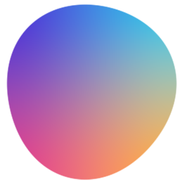
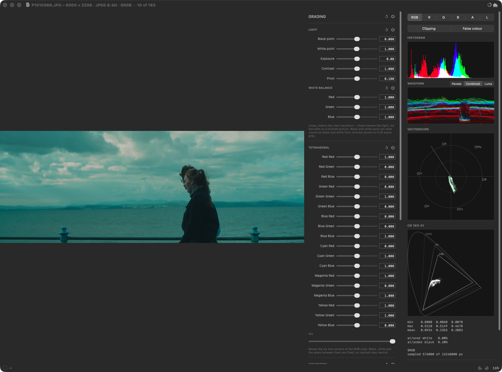
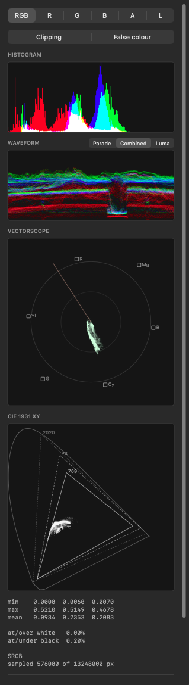

# Lupp

**A fast, colour-honest image viewer for macOS.** *Lupp* is Swedish for the loupe
you put on a lightbox to inspect a frame.

Built to be a default image viewer that opens instantly and tells you the truth
about what's in the file — including the parts above diffuse white. It reads 62
formats, measures what it shows, and can grade and export without ever writing to
your original.

```bash
git clone https://github.com/Erindale/lupp && cd lupp
./build.sh && open Lupp.app
```



*One window: the picture, the colour panel that changes it, and the inspector
that measures it. Every colour in the chrome — including the backdrop behind the
image — comes from a single adjustable number.*

## What it does

- **Opens 62 formats** — JPEG, PNG, HEIC, TIFF, GIF, WebP, AVIF, JPEG XL, PSD
  (composite), Radiance HDR, OpenEXR, and camera RAW from most manufacturers.
  The list comes from ImageIO at build time, so it tracks your macOS version.
  See `Lupp ▸ Formats Lupp Can Read…` for the exact set on your machine.
- **Scroll to zoom**, anchored under the cursor. Middle-mouse or space-drag to
  pan. Pinch to zoom on a trackpad.
- **Eyedropper readout** — linear float RGB under the cursor, plus the sRGB hex,
  plus alpha, live as you move.
- **A linear-light pipeline.** Values are scene-referred throughout, so an EXR
  pixel at 8.0 is reported and displayed as 8.0 rather than clipped to white. HDR
  files are flagged with their peak value in the title bar.
- **Storage is chosen per file.** An eight-bit, opaque, sRGB image — most
  photographs — is kept as bytes and linearised by the GPU sampler, which is a
  quarter of the memory and about a third of the time of expanding it to float.
  Anything the bytes would lose (deeper than eight bits, alpha, a wider gamut,
  scene-linear values) takes the float path. Nothing above the storage layer can
  tell the difference; the numbers are identical either way.
- **Decoded images are cached, and the next one is read ahead.** Going back to a
  picture you've already seen is instant, and stepping forward decodes while
  you're still looking at the current frame — which matters most over a network
  share, where fetching the bytes costs more than decoding them.
- **Exposure offset** (`E` / `⇧E`) to inspect into highlights or shadows.
- **Arrow keys** step through the rest of the folder, numerically sorted so
  `frame_2` comes before `frame_10`.
- Nearest-neighbour sampling above 200%, so at high zoom you see the pixels in
  the file rather than the viewer's interpolation.
- **Two side panels**, toggled independently from the title bar and usable side
  by side. The **inspector** reports on the image; the **colour** panel changes
  it. Nothing in the inspector touches a pixel.
- **Scopes measure the graded image, live.** They're computed from a small render
  through the same shader as the canvas, so they always agree with the picture and
  update as you drag a slider.
- **Inspector** (`M`) — histogram, waveform (RGB parade, combined, or luma),
  vectorscope with a BT.709 graticule and skin-tone line, and a CIE 1931 xy plot
  with the spectral locus and Rec.709 / P3 / Rec.2020 gamut triangles. Plus
  per-channel min/max/mean and clipping percentages.
- **Colour** — a LUT library, an 18-parameter tetrahedral grade, saved presets,
  and export.
- **Every image opens unedited.** A grade belongs to the picture it was made for,
  so it never carries into the next file, and no LUT is ever applied unless you
  ask for one.
- **Drag an image onto the window** to open it, as well as Finder and File ▸ Open.
- **Display controls** in the same panel — isolate R/G/B/A/Luma, a clipping
  overlay, and an ARRI-style false-colour exposure ramp.
- **View transforms** — Standard, AgX, ACES Filmic and Raw, defaulted from what
  the file is and overridable.
- **`.cube` LUTs** — load a 3D (or 1D) LUT, with an intensity slider, and log
  input encodings for camera LUTs.
- **Rotate** (⌘\[ / ⌘\]) for a file that is wrong about which way up it is —
  applied to the decoded pixels, never written back to your original.
- **Interface size** — 80% to 150%, for a 14" laptop or a 32" monitor at arm's
  length.
- **Camera RAW** — ARW, CR2/CR3, NEF, RAF, ORF, RW2, DNG and more, through
  Apple's RAW pipeline.

The window is one continuous surface: the title bar, the canvas and the readout
footer all share a single background colour, defined once and converted to linear
for the Metal drawable so they can't drift apart.



## Colour spaces, all labelled

The eyedropper reports **linear** values — the file's own light-linear data,
where an EXR highlight reads 8.0.

The histogram, waveform, parade and vectorscope bin **sRGB-encoded** values,
because that's what every grading tool shows and a linear histogram crushes
almost everything into the bottom eighth of the graph. A 50% grey field peaks
mid-histogram, not at 21%.

The CIE scope uses **linear** tristimulus values, because chromaticity is a
property of the light; running it on encoded values would put every point in the
wrong place.

Three different answers to three different questions, which is exactly why each
one says which it is rather than leaving you to guess.

## View transforms

A file records its **colour space**, and Lupp reads and applies that
automatically. A file does not record a **view transform** — Blender doesn't
write "I was rendered through AgX" into an EXR — so Lupp picks a default from
what kind of file it is and lets you override it:

- **Scene-linear** sources (EXR, Radiance, any linear profile) default to **AgX**,
  approximating Blender 4.x's default so renders look like they do in the
  viewport rather than blown out.
- **Display-referred** sources (a JPEG, a PNG) default to **Standard** — already
  graded, so no tone map is applied and nothing is mapped twice.

Also available: **ACES Filmic** (the Hill/Narkowicz RRT+ODT fit, not the
reference LUTs) and **Raw** (Blender's — no encode at all, for inspecting normal
or depth data). The override sticks per class of file, so choosing ACES for one
EXR applies to the next one without leaking onto a JPEG. The panel always says
what was detected and whether you're overriding it.

AgX and ACES here are **analytic approximations**, close to but not identical
with the reference transforms.

## Grading

The chain runs: **light** in linear, then the **view transform**, then the
**LUT**, then the **cube warp**, then **saturation**, then what to do with the
result. The panel lists light, the cube warp and saturation in that order; the
LUT sits lower down with the presets and export, so panel order and pipeline
order agree everywhere except the LUT, which is applied before the cube warp
rather than after it.

**Every section has a bypass** beside its title, and there's a master one at the
top (`B`). Lit means applied, dimmed means bypassed. A bypassed section keeps its
values and simply stops being applied, so comparing costs nothing and switching
back returns exactly where you were — and you can isolate one change at a time
rather than judging the whole grade at once.

**Hold Shift while dragging** any slider to move it at a tenth speed. On the crop
it does the same and adds a magnifier at the edge you're placing, with its pixel
coordinate — the difference between being able to set a value and having to type
it.

**Crop** — drag the rectangle on the image, with rule-of-thirds guides and aspect
presets that both reshape the crop and then hold it: a locked ratio constrains
every subsequent drag, rather than shaping it once and letting go.
**Applied** makes the crop the working image: zoom, the readout and the scopes
all follow it, and the overlay goes away. Nothing is discarded — the source
pixels are still there and switching back to **Overlay** is free.

Export writes the crop **at its own pixel size**, not the whole frame with the
edges painted out. It's a window into the source texture, so a cropped export
goes through the same shader as everything else.

**Light** — black and white point, exposure (EV), a three-channel white balance,
and a contrast with an adjustable pivot. Black and white point come first, since
they say what counts as black and white in the source and everything after works
in those terms. All of it is applied in **linear, before the view transform**,
so they behave like light rather than like edits to an already-rendered picture.
Contrast pivots on 0.18 scene grey by default, rather than on whatever 0.5 means
in the current encoding.

**Saturation** comes *after* the cube warp, which is the whole point of where it
sits. Pulled to zero it renders the luma of whatever the corners just did, so the
six hue corners become a channel mixer for black and white — drop the cyan
corner's green and a teal sky goes heavy and dramatic without touching skin. In
front of the warp it could only ever be a fader on the original colours.

**Tetrahedral interpolation**, after
[hotgluebanjo's TetraInterp](https://github.com/hotgluebanjo/TetraInterp-DCTL).
The RGB cube splits into six tetrahedra by the ordering of r, g and b; each has
black and white as two of its vertices, so those — and the whole grey axis
between them — stay fixed however far the six hue corners are moved. That is what
makes it a colour *warp* rather than a tint: it cannot push a neutral off
neutral. Eighteen sliders, laid out as Resolve lays out the DCTL, with a mix
amount and a reset.

Each slider is **centred on its own identity value** rather than sharing one
absolute range, so a handle in the middle always means "unchanged" and its
distance from the middle reads directly as deviation. That's why a default of
0.000 and one of 1.000 both start centred.

**Presets** store the view transform, the whole light section, LUT choice and all
eighteen corner values — and applying one moves the sliders, so it lands as a
starting point you can carry on adjusting rather than an opaque state. Window size and zoom are deliberately excluded — they're how you
were looking at an image, not what you did to it. *Apply Last* puts back the
grade you were most recently working in.

**Export as Displayed…** (⇧⌘E) writes the image at full resolution with the view
transform, LUT, grade and exposure baked in. It renders through the *same shader*
as the screen, so an export is what you were looking at rather than a second
implementation that can drift. **PNG**, **JPEG** (quality 0.95) and **TIFF** —
8-bit for PNG and JPEG, 16-bit for TIFF, where the extra depth is the reason to
pick it.

## LUTs

`Add…` in the colour panel takes an Adobe/IRIDAS `.cube` file, 3D or 1D, and
applies it with an adjustable intensity. Loaded LUTs join a library you can pick
from or remove entries from; the file is re-read on use, so editing a LUT on disk
takes effect next time rather than serving a stale copy. It's uploaded as a 3D
texture and sampled trilinearly — precisely what the format describes, so the GPU
does the interpolation the format was designed around.

### What the LUT is fed

A `.cube` is a lookup with no idea what space its input is in — the author simply
assumed one. Get it wrong and the LUT is applied to the wrong numbers, which
looks like a bad grade rather than like a mistake. So the input is a setting:

- **Display (sRGB)** — the usual creative LUT, applied after the view transform.
- **S-Log3**, **LogC3 (ARRI)**, **ACEScct**, **V-Log (Panasonic)** — the LUT is
  fed log-encoded scene
  values instead. A log LUT is almost always the display rendering itself (log
  in, Rec.709 out), so choosing one means the LUT *replaces* the view transform
  rather than sitting on top of it. Tone-mapping twice would be wrong.

**The limit worth knowing:** these are transfer curves only. A LUT authored for
S-Log3 usually also expects S-Gamut3 *primaries*, and nothing in an image file
reliably says which primaries it holds — ImageIO reports Rec.709 for almost
everything. So the curve will be right and the gamut may not be. For footage
already in Rec.709 (most stills), the gamut matches and the result is correct.

LUTs you add are **copied into `~/Library/Application Support/Lupp/LUTs`**, so
the library keeps working after you tidy your Downloads folder. Removing an entry
deletes the app's copy; your original is never touched.

## Camera RAW

RAW decoding goes through Apple's pipeline — the same one Preview and Photos
use — which on this machine supports **918 camera models**, including 113 Sony
bodies. `Lupp ▸ Formats Lupp Can Read…` lists the file types; the model list
comes from macOS and grows with OS updates, so a very new body may need one.

Two things follow from that. RAW files arrive **already rendered** by Apple's
demosaic and default tone curve, so they are treated as display-referred and
**will not match Lightroom** — it's Apple's interpretation, not Adobe's. And
decoding is slower than a JPEG; a 60 MP frame takes about a second.

## How zoom behaves

Three rules, and they are the whole model:

1. An image **smaller** than the window opens at **100%** — never enlarged
   without being asked, because upscaling shows you the viewer's interpolation
   instead of the file.
2. An image **larger** than the window **scales to fit** the window it opens
   into.
3. **Resizing the window never changes the zoom.** The window is a viewport that
   moves over the image, so dragging its edge reveals more of the picture at the
   same magnification.

Windows share one remembered frame, so a new image opens at whatever size you
were last working at rather than resizing your window to match the file. Only the
first window you ever open sizes itself to the image.

## Controls

| | |
|---|---|
| Scroll wheel | Zoom, anchored at the cursor |
| Two-finger scroll / pinch | Pan / zoom (trackpad) |
| ⌥ + scroll | Invert zoom-vs-pan for one gesture |
| Left-drag | Pan |
| Middle-mouse drag | Pan (where macOS lets it through) |
| Space + drag | Pan |
| ← → | Previous / next image in the folder |
| Home / End | Zoom to fit / 1 image pixel per screen pixel |
| `E` / `⇧E` / `R` | Exposure up / down / reset |
| `M` / `N` | Show / hide the inspector / colour panel |
| 1–6 | RGB / R / G / B / A / Luma |
| `C` / `F` | Clipping overlay / false colour |
| ⌘\[ / ⌘\] | Rotate anticlockwise / clockwise |
| ⇧⌘E | Export as displayed |
| Right-drag on the image | Lighten / darken the backdrop |

**Every colour in the window is derived from one number.** The backdrop is
adjustable because the right surround depends on the image — a bright one makes a
dark frame look washed out — and the canvas, title bar, both panels, the footer,
every label, the slider tracks and the scrollbar pill all recompute from it, so
the whole app moves together rather than the canvas drifting away from its chrome.

Text ramps continuously within each polarity, pushed hardest toward the extremes
as the backdrop nears mid grey — where contrast is scarcest — and eased off at the
ends, where there is plenty and pure white would only glare. Primary text never
drops below about 4:1 anywhere in the range.

Two things are deliberately not continuous. Text polarity has to switch once: no
continuous path from white to black avoids passing through mid grey, which against
a mid-grey backdrop is illegible, so the crossover sits at 0.5 where both options
are at their most readable. And AppKit control chrome has no continuum — a
segmented control is either its light or its dark rendering — so that switches
with it.

Scope plates track the backdrop but stay in the lower part of the range: they
carry light traces, and a plate pale enough to match a bright surround would erase
them.

## Becoming your default viewer

`Lupp ▸ Make Lupp the Default Image Viewer…` sets the handler for 14 common
types. macOS confirms **once per file type**, so expect a run of prompts; you can
stop partway and whatever you confirmed sticks. Requires macOS 15+. On earlier
versions, select a file in Finder, press ⌘I, change "Open with" and click
"Change All…".

## Building

Needs the Command Line Tools only — **no Xcode**. `swift build` produces the
binary and `build.sh` wraps it in a `.app`, generating the icon with CoreGraphics
and the Info.plist from ImageIO's own format list. Metal shaders compile at
runtime from source, because the offline `metal` compiler ships with Xcode rather
than the CLT.

```bash
./build.sh                              # → Lupp.app
./Lupp.app/Contents/MacOS/Lupp --selftest
./Lupp.app/Contents/MacOS/Lupp image.exr
./Lupp.app/Contents/MacOS/Lupp --time-load ~/Pictures
LUPP_DEBUG=1 ./Lupp.app/Contents/MacOS/Lupp   # logs scroll events
```

`--selftest` runs 55 checks on the things a screenshot can't confirm: that sRGB
linearizes correctly, that both storage paths produce identical values, that EXR
values above 1.0 survive decoding, that all four EXIF rotations land the right way
up, that alpha is un-premultiplied, that the grade defaults are a true no-op, that
each camera log curve hits its published mid-grey anchor, and that an exported file
round-trips to the same pixels.

`--time-load <folder>` reports what each file costs to open, which storage it
landed in, and what a second visit costs — useful when the pictures live on a
network share and you want to know which half of the time is the network.

## Known limits

These are real and mostly deliberate.

- **Not notarized.** The build is ad-hoc signed, which is fine on the machine
  that built it. A `.app` downloaded from elsewhere will be blocked by
  Gatekeeper — notarization needs a paid Apple Developer account. Build from
  source.
- **Not sandboxed**, on purpose. Under App Sandbox, opening a file grants that
  file and nothing else, which would leave arrow-key navigation reading an empty
  folder.
- **Memory is the cost of working in float.** A file that needs the float path is
  16 bytes a pixel — a 24 MP frame is ~384 MB. Ordinary eight-bit photographs
  take the byte path instead and cost 4 bytes a pixel, or ~96 MB. Above 120 MP,
  Lupp decodes a reduced version and says `reduced` in the readout. The
  decoded-image cache is bounded at a sixteenth of physical memory and emptied
  when the last window closes.
- **No DPX or Cineon**; ImageIO doesn't read them. PSD is composite only, never
  layers.
- **RAW is Apple's rendering, not the camera's or Adobe's**, and there are no
  RAW development controls yet — no exposure, temperature or tint on the RAW
  itself, just the rendered result.
- **Log LUT inputs are transfer curves only.** The primaries a camera LUT expects
  are not recorded in any image file, so the curve will be right and the gamut may
  not be. See [What the LUT is fed](#what-the-lut-is-fed).
- **The eyedropper reports scene-linear values in extended sRGB**, converted by
  CoreGraphics from whatever the file declared. That is one of several defensible
  answers to "what colour is this pixel" — it is not the display-mapped value you
  are looking at, and for a wide-gamut file the two differ.
- **Scopes sample up to 600k pixels**, strided across the image, not every pixel.
  Statistically indistinguishable and far faster; the exact count is shown in the
  panel. They also cover the whole image, not the visible region.
- **Telling a mouse from a trackpad is a heuristic.** Lupp uses gesture phase,
  which smooth-scrolling drivers (Logi Options+ and friends) don't fake — unlike
  `hasPreciseScrollingDeltas`, which they do. If it still guesses wrong, untick
  `View ▸ Scroll Wheel Zooms`.
- **Middle-click may never reach the app.** macOS Mouse settings often bind
  button 3 to Mission Control, which swallows it. Space-drag always works.

## Not here yet

Palette extraction, image-sequence playback, and video with the same readout,
scopes and right-drag scrubbing. Video is the big one: `AVPlayerLayer` won't
hand pixels back, so an honest readout needs `AVPlayerItemVideoOutput` plus the
YCbCr matrix and transfer function from the track — which is exactly where most
tools quietly get the numbers wrong.

## Sessions

`File ▸ Save Session…` (⌘S) writes a `.lupp` file beside your work: which image
you were editing, and every value you set — light, white balance, cube corners,
LUT choice and amount and input, crop, bypasses, which channel you were looking
at. Open one (⇧⌘O, or double-click) and it reopens that image with all of it
live and still adjustable. It is a starting point restored, not a result frozen.

**The image is referenced, not embedded.** A session beside a 200 MB EXR is a few
kilobytes of numbers, and nothing is ever written back to your source. Both the
path and a file-system bookmark are stored: the path is what you can read and fix
in a text editor, the bookmark is what still finds the file after it has been
moved or renamed.

**A session is only ever written when you ask for one.** There is no autosave and
no periodic write; open an image, grade it, close it, and nothing is left behind.
Sessions are for the occasional image worth coming back to, not a record of
everything you looked at.

The one exception is repairing a session you already have. If its image can't be
found, Lupp names it, shows where it used to be, and offers **Find…** — opening
the picker in the folder it came from, since a moved file is usually still
nearby. What you point it at *is* written back, because you chose it and because
a session left broken would ask again every time. A move the bookmark can resolve
by itself doesn't write anything at all: there's no choice of yours to record.

## The icon

The app ships a squircle, because macOS 26 composites a legacy `.icns` onto a
light plate wherever the artwork leaves the tile transparent — a free-form
silhouette gets a white rounded square behind it.

`Icon/` holds the original organic version for assigning by hand, where that
doesn't apply: open Get Info on `Lupp.app`, click the icon at the top left, and
paste `Lupp-organic-1024.png`. Both come from the same generator —
`swift Tools/makeicon.swift --organic <dir>`.

## Licence

MIT — see [LICENSE](LICENSE).

Lupp vendors no third-party code and has no package dependencies, but it does
implement algorithms worked out by other people. They're credited in
[ACKNOWLEDGEMENTS.md](ACKNOWLEDGEMENTS.md), along with the camera-log trademarks
Lupp names in order to say which encodings it supports.
